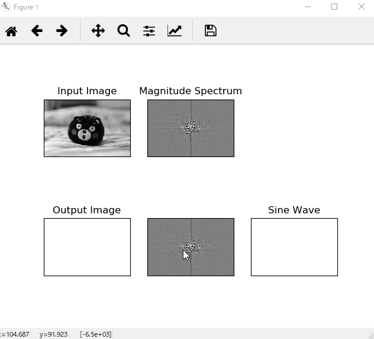

どんな処理にしたのか
-------------------
まず、画像を読み込み画像サイズが大きい場合縮小する。
次に、画像をグレースケールに変換しフーリエ変換をする。
そして、左上にグレースケールの元画像、中上と中下にパワースペクトル、左下にクリックしたサイン波を重ね合わせたもの、右下にクリックしたところのみのサイン波を表示する。
また、マウスイベントごとにコードを設定しサイン波を更新するようにする。

依存ライブラリとバージョン
-------------------
numpy(1.16.2),Pillow(5.4.1),matplotlib(3.0.3)

参考にしたサイトのリンク
-------------------
「Python関連―十河研究室」
http://www.s12600.net/psy/etc/python.html
の、「2次元Fourier変換で遊ぶFFT2demo」にあるコードを参考にした。

実行の様子をgifアニメーションで表示する。
-------------------
「Ctrl+左クリック」したところのサイン波を右に、サイン波を重ね合わせたものを左に表示する。

